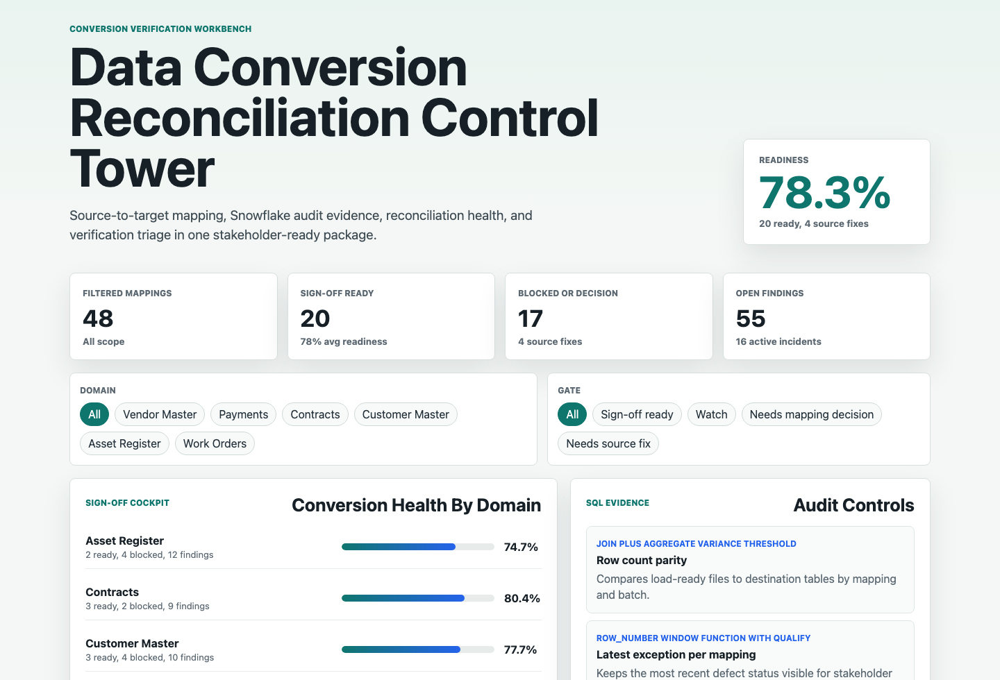
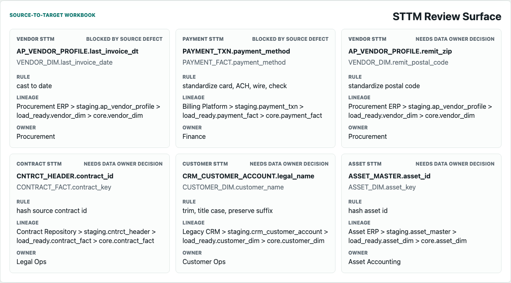
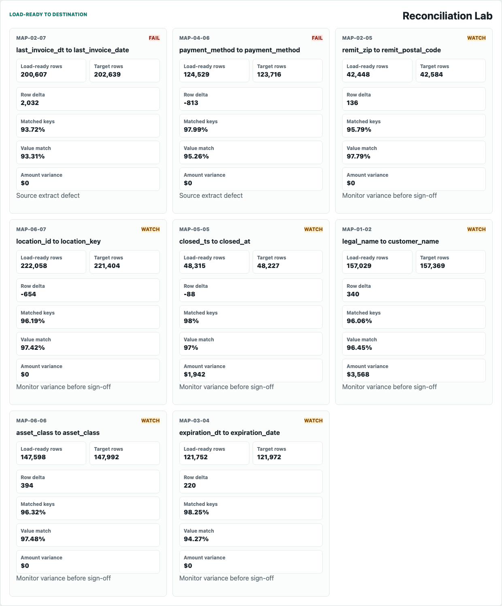
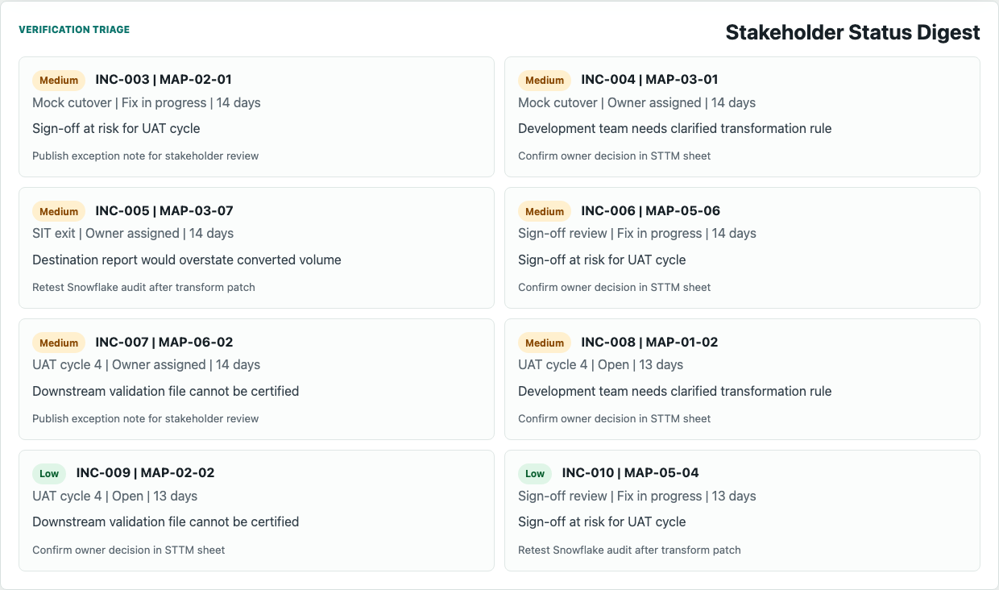

# Data Conversion Reconciliation Control Tower

An interactive portfolio artifact for an enterprise data conversion team that needs reliable source-to-target mapping, Snowflake audit evidence, reconciliation reporting, and verification-phase incident triage before a migration sign-off.

The project answers one practical question:

> Which conversion mappings are ready for stakeholder sign-off, which ones are blocked by source or mapping issues, and what evidence should the analyst bring to the next review?

## Why This Exists

Data conversion analyst work is not only dashboard reporting. The role has to translate source-system complexity into STTM documentation, write SQL that catches defects before production, reconcile load-ready files against destination tables, and communicate blockers in business terms. This artifact packages that workflow as a small control tower:

- Field-level source-to-target mapping register with transformation rules, lineage, owners, and sign-off state.
- Side-by-side reconciliation checks for load-ready rows, destination rows, matched keys, value parity, null drift, duplicate keys, orphan records, and amount variance.
- Snowflake-style SQL audit patterns using joins, subqueries, aggregates, and window functions.
- Verification incident digest that turns defects into owner-ready next steps.

## Screenshots

### Conversion Health Cockpit

Shows readiness by domain, sign-off counts, blockers, and audit controls for the current conversion batch.



### STTM Review Surface

Shows source-to-target mappings with transformation rules, lineage paths, workbook tabs, owners, and sign-off status.



### Reconciliation Lab

Shows load-ready to destination variance checks for row counts, key matching, value matching, null drift, duplicate keys, orphan records, and amount variance.



### Verification Triage Digest

Shows incident status, verification phase, root cause category, business impact, next update, and retest path.



## What Is In The Project

- `index.html`: static app shell for the interactive control tower.
- `src/app.js`: renders the generated analysis payload, filters, mapping queue, reconciliation lab, and incident digest.
- `src/styles.css`: workbench styling for desktop and mobile.
- `scripts/score_operating_data.py`: synthetic data generator and transparent readiness scoring logic.
- `data/mapping_register.csv`: field-level STTM register.
- `data/reconciliation_results.csv`: load-ready to destination reconciliation results.
- `data/data_quality_findings.csv`: SQL audit findings and root-cause signals.
- `data/incident_triage.csv`: verification incident status digest.
- `analysis/sql_checks.sql`: Snowflake-style SQL audit patterns.
- `analysis/outputs/`: generated priority queues, summaries, and app payload.
- `data_dictionary.md`: field definitions and synthesis notes.
- `docs/images/`: screenshots captured from the rendered artifact.

## Data Strategy

The data is synthetic because no public client migration workbook, Snowflake audit tables, load-ready files, destination validation tables, or verification incident logs are available. The synthetic structure is modeled on a common enterprise migration program:

- Source systems feed staging and load-ready tables.
- Field-level mapping rows define the STTM contract.
- Destination tables are validated against load-ready files.
- Business owners approve or block mappings in workbook-style tabs.
- SQL findings become verification incidents with root cause, owner, impact, and retest path.

The generator uses a fixed random seed so the artifact is reproducible. It creates 48 mapping rows across Customer Master, Vendor Master, Contracts, Payments, Work Orders, and Asset Register domains. Most records are pass or watch cases, while a smaller set receives realistic defects such as row count variance, null drift, duplicate business keys, reference misses, value variance, and mapping ambiguity.

Readiness is scored with transparent rules rather than a predictive model. The score combines reconciliation performance, STTM sign-off state, mapping complexity, criticality, and open findings. This keeps the output explainable for stakeholder review.

The data is not real company performance data and should not be interpreted as actual migration results.

## Role Fit

This artifact demonstrates the work expected from a data conversion and reconciliation analyst:

- Create STTM documentation that development teams can build from.
- Use advanced SQL patterns to audit large conversion datasets.
- Reconcile load-ready files against destination systems.
- Track conversion health through automated reporting outputs.
- Translate technical defects into business impact and stakeholder next steps.
- Support verification triage with root cause, aging, ownership, and retest status.

## Scope

What this artifact does:

- Generates a reproducible synthetic conversion data package.
- Scores field-level mappings for sign-off readiness.
- Provides a multi-surface UI for executive health, STTM review, reconciliation, and triage.
- Includes SQL evidence that mirrors the checks an analyst would run in Snowflake.
- Documents the assumptions behind the synthetic data.

What this artifact does not do:

- It does not connect to a live Snowflake account, Google Sheet, ERP, CRM, billing platform, field service system, or production migration tool.
- It does not claim to represent any real company, client, or migration program.
- It does not train a predictive model because the target workflow values explainable reconciliation controls and stakeholder sign-off evidence.

## Run Locally

```bash
npm start
```

Then open `http://localhost:5174`.

To regenerate the synthetic data and analysis outputs:

```bash
npm run analyze
```
